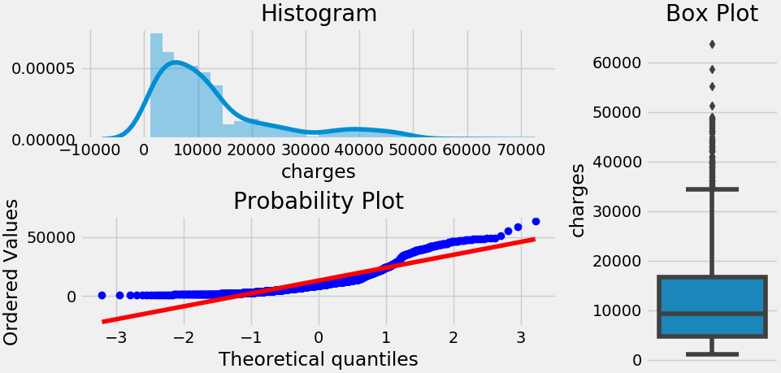
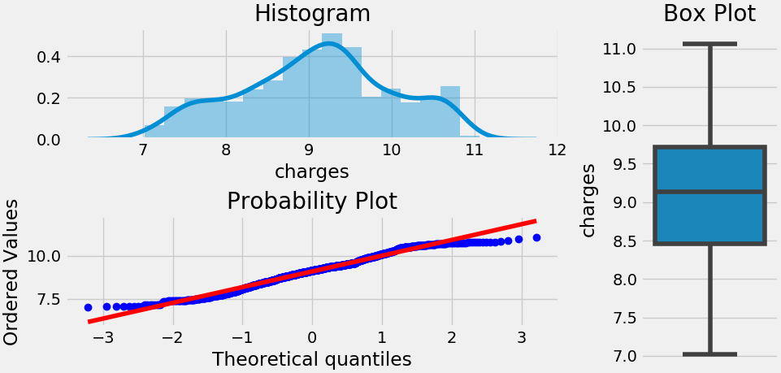
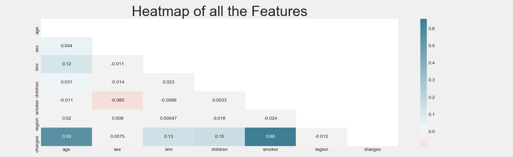

# evolutiongames
Developing ML model for prediction of charges in Insurance

Initial insurance.csv dataset has 1338 values - age,sex,bmi,children,smoker,region,charges.
In order to divide the insurance.csv file (1338 raws) into train and test files accordingly, I have used the 80/20 rule, so train set contains 1069 raws, test - 269 raws

**Observation**
Most of the features are object( includes string values in the variable).
I want to focus on the target variable which is 'charges'. Let's create a histogram to see if the target variable is Normally distributed.
If we want to create any linear model, it is essential that the features are normally distributed. This is one of the assumptions of multiple linear regression.


Now, let's make sure that the target variable follows a normal distribution.
```
data.train_set[TARGET_PREDICTION_VALUE] = numpy.log1p(data.train_set[TARGET_PREDICTION_VALUE])
```

As you can see, the log transformation removes the normality of errors, which solves most of the other errors we talked about above. 
No or Little multicollinearity: Multicollinearity is when there is a strong correlation between independent variables. Linear regression or multilinear regression requires independent variables to have little or no similar features. Multicollinearity can lead to a variety of problems, including:

The effect of predictor variables estimated by our regression will depend on what other variables are included in our model.
Predictors can have wildly different results depending on the observations in our sample, and small changes in samples can result in very different estimated effects.
With very high multicollinearity, the inverse matrix, the computer calculates may not be accurate.
We can no longer interpret a coefficient on a variable as the effect on the target of a one-unit increase in that variable holding the other variables constant. The reason behind that is, when predictors are strongly correlated, there is not a scenario in which one variable can change without a conditional change in another variable.
Heatmap is an excellent way to identify whether there is multicollinearity or not.


Let's also find out how the 'charges' is distributed.
```
print("Skewness: " + str(data.test_set[TARGET_PREDICTION_VALUE].skew()))
print("Kurtosis: " + str(data.test_set[TARGET_PREDICTION_VALUE].kurt()))
```
The results are the foolowing:
```
Skewness: 1.5962357538476684
Kurtosis: 2.017732302093513
```
It looks like there are quite a bit Skewness and Kurtosis in the target variable. Let's talk about those a bit.

Skewness

is the degree of distortion from the symmetrical bell curve or the normal curve.
So, a symmetrical distribution will have a skewness of "0".
There are two types of Skewness: Positive and Negative.
Positive Skewness(similar to our target variable distribution) means the tail on the right side of the distribution is longer and fatter.
In positive Skewness the mean and median will be greater than the mode similar to this dataset. Which means more houses were sold by less than the average price.
Negative Skewness means the tail on the left side of the distribution is longer and fatter.
In negative Skewness the mean and median will be less than the mode.
Skewness differentiates in extreme values in one versus the other tail.
Here is a picture to make more sense.
Kurtosis According to Wikipedia,

In probability theory and statistics, Kurtosis is the measure of the "tailedness" of the probability. distribution of a real-valued random variable. So, In other words, it is the measure of the extreme values(outliers) present in the distribution.

There are three types of Kurtosis: Mesokurtic, Leptokurtic, and Platykurtic.
Mesokurtic is similar to the normal curve with the standard value of 3. This means that the extreme values of this distribution are similar to that of a normal distribution.
Leptokurtic Example of leptokurtic distributions are the T-distributions with small degrees of freedom.
Platykurtic: Platykurtic describes a particular statistical distribution with thinner tails than a normal distribution. Because this distribution has thin tails, it has fewer outliers (e.g., extreme values three or more standard deviations from the mean) than do mesokurtic and leptokurtic distributions.

**Feature engineering**
After finding correlations and weakpalces in the data, I made the following enhancements:
```
def fixing_skewness(data):
    ## Getting all the data that are not of "object" type.
    numeric_feats = data.dtypes[data.dtypes != "object"].index
    # Check the skew of all numerical features
    skewed_feats = data[numeric_feats].apply(lambda x: skew(x)).sort_values(ascending=False)
    high_skew = skewed_feats[abs(skewed_feats) > 0.5]
    skewed_features = high_skew.index
    for feat in skewed_features:
        data[feat] = boxcox1p(data[feat], boxcox_normmax(data[feat] + 1))
```
in order to fix the skewness.

So, after all preparations the data looked good, taking into account that we have linear relations inside the data sets, I choose LinearRegression as a simple model for fitting and predicting the data.
Including all the above featuring and adjustments I got the **0.79** accuracy result.
